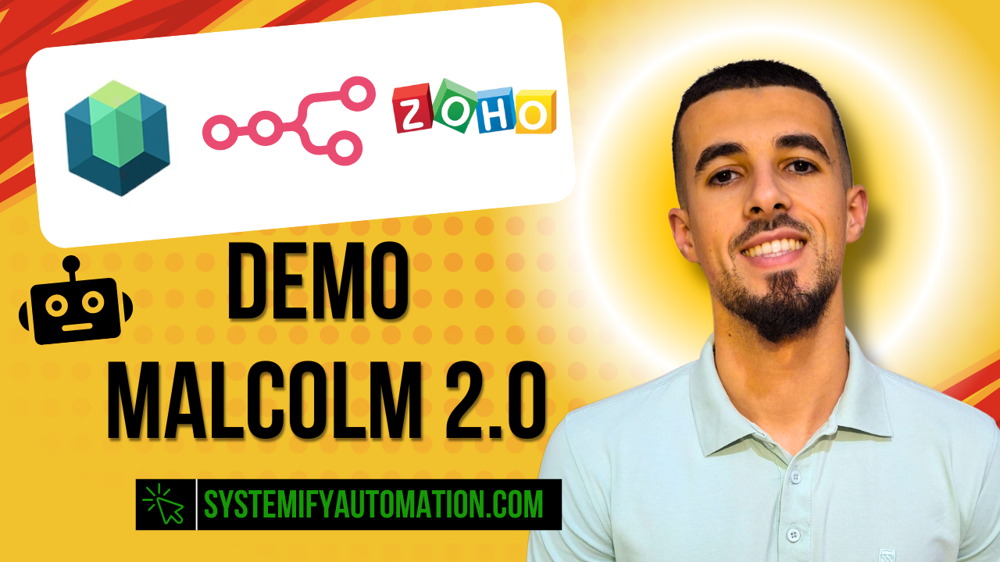

# SGA AI Assistant Chrome Extension

A premium Chrome extension for SGA Consulting that streamlines AI workflow management directly within Google Docs. Features a beautiful glass morphism interface with three powerful workflows: report approval, feedback submission, and AI rule management.

## 📺 Video Demo

Watch how it works:

[](https://drive.google.com/file/d/1FVVwdtEs5CGnpMyqlIsubxD0jEmIqTsF/view?usp=sharing)

[**▶️ Watch the full demonstration**](https://drive.google.com/file/d/1FVVwdtEs5CGnpMyqlIsubxD0jEmIqTsF/view?usp=sharing)

## 🎯 Features

### Three Powerful Workflows

1. **✅ Approve Report**
   - One-click approval of AI-generated reports
   - Instantly sends approval notification to n8n webhook
   - Perfect for quick validation workflows

2. **📝 Adjust Report**
   - Provide detailed feedback on AI outputs
   - Add context and specific prompt suggestions
   - Form state persistence with localStorage
   - Ideal for iterative AI improvements

3. **⚙️ New Rules**
   - Create new AI behavior rules on the fly
   - Dynamic rule input system (add/remove fields)
   - Persistent form data for convenience
   - Submit multiple rules in one batch

### Premium UI/UX
- 🎨 Modern glass morphism design
- 🔵 Blue gradient theme with orange accents
- ✨ Smooth animations and transitions
- 📱 Responsive 500x650px popup interface
- 🔒 CSP-compliant (Content Security Policy)

## 📦 Installation

### For End Users (SGA Clients)

1. Install directly from the Chrome Web Store link provided by SGA Consulting
2. Click **"Add to Chrome"**
3. The SGA AI Assistant icon will appear in your browser toolbar
4. Open any Google Doc and start using the extension

**No configuration needed** - webhooks are pre-configured for your organization.

### For Development

1. Clone this repository (requires access to `config.js` with production webhooks)
2. Open Chrome and navigate to `chrome://extensions/`
3. Enable **"Developer mode"** in the top right corner
4. Click **"Load unpacked"** and select the extension folder
5. The SGA AI Assistant icon will appear in your browser toolbar

## 🚀 Usage

### Approve Report
1. Open any Google Doc
2. Click the SGA AI Assistant icon in your toolbar
3. Click the **"Approve Report"** button
4. Confirmation message appears and webhook is triggered

### Adjust Report
1. Click the SGA AI Assistant icon
2. Select **"Adjust Report"**
3. Fill in:
   - **Context:** Background information about the report
   - **Prompt:** Your suggested improvements or adjustments
4. Click **"Submit Feedback"**
5. Your feedback is sent to the n8n webhook

### New Rules
1. Click the SGA AI Assistant icon
2. Select **"New Rules"**
3. Enter rules in the dynamic input fields
4. Click **"+ Add Rule"** to add more fields (up to 10)
5. Click **"Submit Rules"**
6. All rules are sent to the n8n webhook

## 🔗 Webhook Integration

The extension connects to three n8n webhook endpoints (pre-configured):

### 1. Approve Report Webhook
**Payload sent:**
```json
{
<<<<<<< HEAD
  "googleDocId": "Document ID from Google Docs URL",
=======
  "googleDocUrl": "https://docs.google.com/document/d/{FileId}/edit?usp=sharing",
>>>>>>> copilot/add-feedback-extension-ui
  "timestamp": "ISO timestamp"
}
```

### 2. Adjust Report Webhook
**Payload sent:**
```json
{
  "type": "relative",
  "selectedText": "Context provided by user",
  "prompt": "Adjustment instructions from user",
<<<<<<< HEAD
  "googleDocId": "Document ID",
=======
  "googleDocUrl": "https://docs.google.com/document/d/{FileId}/edit?usp=sharing",
>>>>>>> copilot/add-feedback-extension-ui
  "submissionType": "submit" | "submit_and_recreate",
  "timestamp": "ISO timestamp"
}
```

### 3. New Rules Webhook
**Payload sent:**
```json
{
  "rules": ["Rule 1", "Rule 2", "Rule 3", ...],
<<<<<<< HEAD
=======
  "googleDocUrl": "https://docs.google.com/document/d/{FileId}/edit?usp=sharing",
>>>>>>> copilot/add-feedback-extension-ui
  "timestamp": "ISO timestamp"
}
```

## 📁 Project Structure

```
SGA-AI-Feedback/
├── manifest.json          # Extension manifest (V3)
├── README.md              # This file
├── background/
│   └── background.js      # Service worker for webhook calls
├── content/
│   ├── content.js         # Content script for Google Docs
│   └── content.css        # Styles for in-page UI elements
├── popup/
│   ├── popup.html         # Extension popup interface (3 views)
│   ├── popup.css          # Premium glass morphism styles
│   └── popup.js           # Popup logic and webhook handling
└── icons/
    ├── icon16.png         # 16x16 toolbar icon
    ├── icon48.png         # 48x48 extension manager icon
    └── icon128.png        # 128x128 webstore icon
```

## ⚙️ Configuration

### Setting Up Webhooks

1. Copy `config.example.js` to `config.js`:
   ```bash
   cp config.example.js config.js
   ```
## ⚙️ Configuration

**For SGA Clients:** No configuration needed! The extension is pre-configured and ready to use.

**For Developers:** Webhook URLs are stored in `config.js` (git-ignored). Contact SGA Consulting for access to production configuration.
2. Navigate to `chrome://extensions/`
3. Click the **refresh icon** on the SGA AI Assistant card
4. Test changes on a Google Doc

### Key Technologies
- Manifest V3 (Chrome Extensions API)
- Vanilla JavaScript (no frameworks)
- CSS3 (Glass morphism, gradients, animations)
- localStorage API (form persistence)
- Chrome Messaging API (popup ↔ background communication)

## 🐛 Troubleshooting

### Extension not appearing
- Ensure "Developer mode" is enabled in `chrome://extensions/`
- Check that all required files are present in the folder
- Reload the extension after any code changes

### Webhooks not firing
- Open DevTools Console (`F12`) to check for errors
- Verify webhook URLs in `background/background.js`
- Ensure n8n instance is running and accessible
- Check Chrome's `activeTab` permission is granted

### "Not on Google Docs" alert
- Extension only works on `docs.google.com` URLs
- Refresh the Google Doc page after installing extension
- Check the content script is injected properly

### Form data not persisting
- Clear browser cache and reload extension
- Check localStorage is enabled in Chrome settings
- Verify no errors in popup.js console

### Webhooks not firing
- Open DevTools Console (`F12`) to check for errors
- Ensure you have internet connectivity
- Check Chrome's `activeTab` permission is granted
- Contact SGA Consulting support if issues persist
- `host_permissions` - Send data to n8n webhooks

## 🔐 Security

- ✅ No inline JavaScript (CSP-compliant)
- ✅ Event delegation for all interactions
- ✅ Secure webhook communication (HTTPS)
- ✅ No external dependencies or CDNs
- ✅ Minimal permissions required

## 📄 License

© SGA Consulting 2025. All rights reserved.

## 📞 Support

For issues or feature requests, please contact SGA Consulting or open an issue on the repository.

---

**Version:** 1.0.0  
**Last Updated:** 2025  
**Manifest Version:** 3
